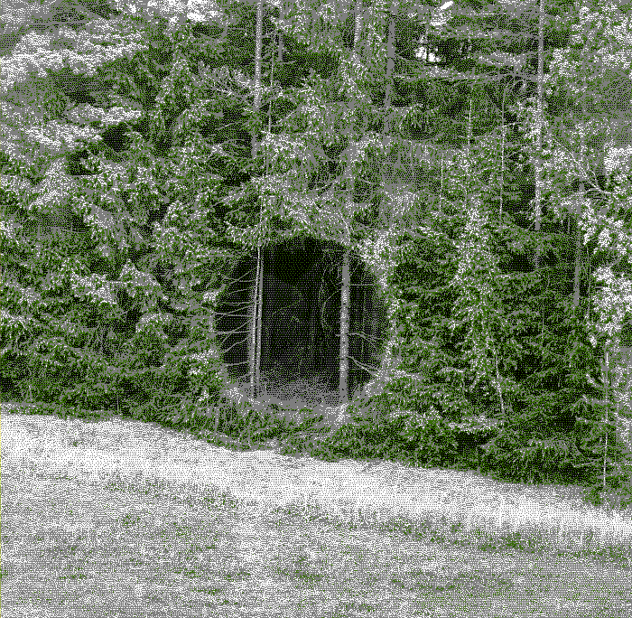

**Deforestation is the removal and destruction of forests**. [The UN FAO estimate that 10 million hectares of forest are cut down each year.](https://ourworldindata.org/deforestation) Two points of importance: one is that there is a difference between deforestation and net forest loss since forests are also regrowing and being replanted, second is that deforestation peaked in the 1980s. It is, however, also important to note that not all forests are equal and here we run into the potential issue with relying too heavily on quantification. We could most likely make most of the planet net positive in forest growth quite quickly by planting trees faster than we're removing them. The question is if we have a reason to trust our claimed understanding of the differences between artificially planted forests and naturally growing ones. Maybe we do? Do we truly understand what a forest is or are we missing it for all the trees?

> There was a time when man\* would walk in my woods, but now he has a mind of metal and wheels. He no longer cares for growing things.  
> \---  
> I am not altogether on anybody’s side, because nobody is altogether on my side, if you understand me: nobody cares for the woods as I care for them, not even Elves nowadays.
> 
> Treebeard (J.R.R. Tolkien), The Lord of the Rings, \* modified quote

**Outgoing connections:**
*   **[[Acceleration]]** - Without the power of old forests to halt the collapse of ecosystems the destruction will only happen faster...
*   **[[Access to food]]** - Much deforestation occurs for the purpose of growing food where a forest once stood, yet surely we've got something wrong here? Replacing a forest with corn fields might be a short term win when it comes to the access to food but a long term disaster.
*   **[[Access to water]]** - Forests store water and there is a clear [recursive connection between deforestation and droughts](https://iopscience.iop.org/article/10.1088/1748-9326/ab738e) and [detrimental consequences beyond certain tipping points](https://www.jstor.org/stable/20208569?mag=deforestation-lead-drought&seq=1).
*   **[[Agriculture]]** - Deforestation is a part of modern agricultural practice.
*   **[[Ancient sunlight, old sunlight, current sunlight]]** - Deforestation is the shutting out of old sunlight.
*   **[[Apathy]]** - Care about the forests? What forests?
*   **[[Biodiversity loss]]** - Remove forests and you remove all species living in and off those forests.
*   **[[Climate change]]** - Forests are the lungs of the world, without them there is only exhalation of carbon, no inhalation or circulation.
*   **[[Complexity mismatch]]** - Old-growth forests harbour immensely complex ecosystems. Reduce this complexity and invite disaster.
*   **[[Desertification]]** - Through soil erosion, droughts, and other cascade effects there are clear [links between deforestation and desertification](https://www.britannica.com/science/desertification/Rain-fed-croplands), both locally and globally.
*   **[[Ecological crisis]]** - No forests, nowhere to live.
*   **[[Extreme weather]]** - Deforestation destabilises all natural systems, including the weather.
*   **[[Failure to take responsibility]]** - Replanting is not enough. How does one take responsibility for silencing the oldest voices on Earth? Fuck you, [Donald R. Currey](https://en.wikipedia.org/wiki/Prometheus_(tree)).
*   **[[Ignored externalities]]** - Deforestation has an endless amount of potentially catastrophic externalities that are largely unaccounted for.
*   **[[Immoral justifications]]** - Believe it or not but no one is truly forcing us to cut down forests.
*   **[[Insect loss]]** - [Over 90%](https://worldrainforests.com/amazon/insects.html) of the species of the Amazon forest are insects.
*   **[[Lack of a living world view]]** - If the world is no longer alive, forests simply consisting of mute grids of planted firs, then that's that, innit?
*   **[[Lack of balance]]** - There is an intricate balance in nature and we should've been more careful of ruining it.
*   **[[Lack of dark spaces]]** - No shade left to hide away from the scorching sunlight.
*   **[[Lack of resilient systems]]** - Old forests are complex and resilient, young forests or clear-cut areas are not.
*   **[[Lack of time]]** - What can we do when the Amazon is lost? Is it too late?
*   **[[Limits to growth]]** - How does our wealth keep growing when the forests are gone? What kind of fucking question is that?
*   **[[Migration]]** - Deforestation forces people to leave their homes, willingly or unwillingly.
*   **[[Missing elders]]** - [Old Tjikko](https://en.wikipedia.org/wiki/Old_Tjikko)'s roots were formed when humans started cultivating grains in the Fertile Crescent.
*   **[[Mistreatment of animals]]** - Burning someone's house down could probably count as mistreatment.
*   **[[Mistreatment of other humans]]** - Same as above, I suppose. Oh, and the global tipping points and total extinction and all that jazz.
*   **[[Monocultures (agriculture)]]** - You can barely begin to compare the complexity of an old-growth forest to the dead homogeneity of modern industrial farmland.
*   **[[Net negative caloric extraction]]** - Cutting down ancient forests to plant soy beans that we feed to cattle that we then eat. Yikes. Homo morus.
*   **[[Planetary boundaries]]** - Deforestation affects most and potentially all of our planetary boundaries.
*   **[[Quantification]]** - Forests aren't created equal but we often treat them like they are. An acre of fast-growing spruce can not be compared in any way to an acre of old oak trees.
*   **[[Resource conflicts]]** - When resources such as wood become scarce, conflicts become inevitable.
*   **[[Sameness]]** - Rapidly growing firs in neat rows, mossless ground, is this why we rush to develop VR?
*   **[[Soil erosion]]** - [Deforestation leads to degrading soil properties](https://www.nature.com/articles/s43017-020-0091-5).
*   **[[The desacration of all places]]** - Few places are as densely packed with the spirits of life-force as old forests.
*   **[[The minimisation of all things wild]]** - Not all places should be tamed.
*   **[[Tipping points]]** - We might have reached irreversible tipping points with regards to the Earth's forests through or deforestation practices.