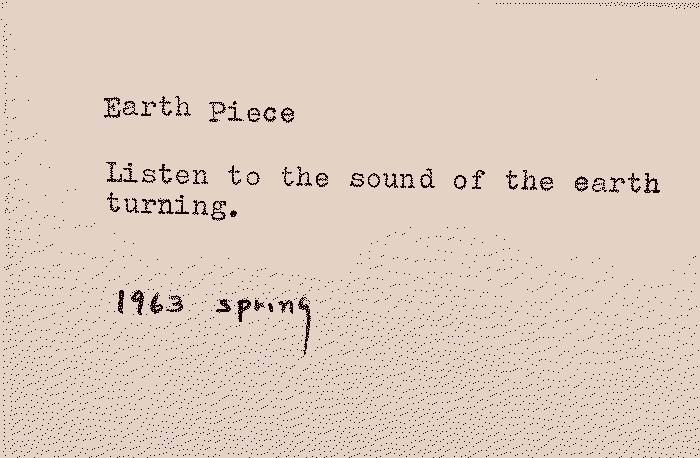

Modernity is controlled by the economic system and, in extension, politicians, institutions, business corporations, and the market. Most political terms are four years and in finance there is often talk of seven year market cycles. Most large-scale decisions fall within this range of time. It is unquestionable that **we have a tendency to focus on the short-term**. The seven year market cycle can be contrasted with something believed to originate in the Great Law of the Iroquois, namely the seven generation stewardship. This [concept urges the current generation to live and work for the benefit of the seventh generation into the future](https://en.wikipedia.org/wiki/Seven_generation_sustainability). What would we do differently if we lived and worked to benefit the seventh generation into the future?

**Outgoing connections:**
*   **[[Acceleration]]** - If we don't care about the longterm we might just as well go faster.
*   **[[Access to food]]** - Do we have longterm methods for securing our access to food?
*   **[[Access to water]]** - Do we have longterm methods for securing our access to drinking water?
*   **[[Agriculture]]** - Do we have longterm methods for indefinitely sustainable agriculture?
*   **[[Ancient sunlight, old sunlight, current sunlight]]** - Do we have longterm methods for how we're using ancient, old, and current sunlight?
*   **[[Catastrophic risks]]** - We are somehow rushing head-first towards catastrophic risks that we are aware of but for some reason we don't seem to mind.
*   **[[Climate change]]** - Climate change is largely driven by a lack of longterm thinking.
*   **[[Dealing with death]]** - Our lack of longterm thinking must surely be deeply connected to our unwillingness to think about our own death.
*   **[[Debt]]** - A debt is a promise of a better future, yet we seem unable to realistically think of a longterm future where any debt can ever be paid.
*   **[[Directionlessness]]** - Without any longterm destination in mind, longterm thinking about direction isn't even relevant.
*   **[[Electric vehicle solutions]]** - There it is everyone, we did it. With electric vehicles we can finally continue with whatever it is we're doing for the rest of time. Finally.
*   **[[End of history]]** - With our disrespect for the past and the longterm future we will enact an implosion of history.
*   **[[Energy]]** - Do we have longterm methods for securing our access to energy?
*   **[[Failure to take responsibility]]** - Without any longterm thinking it becomes impossible to take responsibility for any future consequences of present day decisions and actions.
*   **[[Faulty meta-optimisation]]** - When deciding what to optimise for in life and society we have somehow forgotten how to live in the present moment while simultaneously losing all sense of longterm direction. Do we even exist?
*   **[[Finite games]]** - Finite games seldom benefit from longterm thinking. Unless you want to count Warren Buffett as a longterm thinker. If he is, he's still a massive asshole in my book.
*   **[[Government]]** - A successful politician is not one who focuses on any longterm issues. The longest term is commonly four years.
*   **[[Growth]]** - An imperative to grow indefinitely? Yeah, I don't see why that shouldn't work.
*   **[[Ignorance of ongoing collapse]]** - If one begins to think even tiny bit longterm, one sees that things aren't really going according to plan. Not that there has ever been a plan... But still.
*   **[[Ignored externalities]]** - Most gains are short-term and most externalities are longer-term so why bother?
*   **[[Investing]]** - No financial investment, no matter how longterm you claim it do be, is not sufficiently longterm to be compatible with any desirable future.
*   **[[Jevons paradox]]** - Every longterm technological attempt to increase efficiencies seem wholly ignorant of Jevons paradox.
*   **[[Lack of attentiveness]]** - Ignoring the longterm is often linked with not paying attention to the broader short or long term effects of actions and decisions.
*   **[[Lack of balance]]** - Do we have longterm methods to ensure things are kept in balance?
*   **[[Lack of time]]** - We're too short on time to think about the far future.
*   **[[Lack of visions]]** - Without longterm thinking we've lost visions of the future.
*   **[[Material extraction]]** - Do we have longterm methods for securing our access to necessary materials?
*   **[[Microplastics]]** - Do we have longterm methods for managing the spreading of microplastics?
*   **[[No precautionary principle]]** - Without longterm thinking there will never be any points in favour of caution.
*   **[[No value in maintenance]]** - Maintenance and longterm thinking go hand in hand.
*   **[[Only 'can we' never 'should we']]** - Consequences are irrelevant to those who lack longterm thinking.
*   **[[Predicaments/Parenting]]** - The short-term bliss of silence following the handing over of an iPad to a toddler seems incomparable to its longterm effects.
*   **[[Poisoning the water, the earth, the air]]** - Do we have longterm methods to heal the planet from the poison? Or maybe begin with halting the poisoning?
*   **[[Quantification]]** - Bigger number. Better future.
*   **[[Resources]]** - Do we have longterm methods of securing our access to resources necessary for life?
*   **[[Sense-making crisis]]** - With the inability to consider the longterm we end up incapable of making sense of anything at all.
*   **[[Social media]]** - The adoption of social media was so innocent, ignorant, naive, and almost cute. Too bad it helped polarise the world and facilitate the end of civilisation as we know it. Zuck it up.
*   **[[Suicide]]** - I'm proud of a decision I took as a teenager. I decided to not commit suicide until I was 25. That little dose of longterm thinking ended up with me being 25 and having completely forgotten about suicide and now here I am many years later. Without any longterm broader considerations suicide can sound comforting.
*   **[[Sustainable growth]]** - Most principles of sustainable growth are suggested by people unable to decide what to eat for lunch before it comes out of their asses.
*   **[[Unbalanced longtermism]]** - The few examples you get of longterm thinking in mainstream media is so ridiculously unbalanced and non-longtermistic that I am unsure of whether to laugh or cry.
*   **[[Wisdom crisis]]** - Our inability for anything longterm is one of the roots of our crisis of missing wisdom.
*   **[[Yuppie dystopia]]** - Stay sexy, fellow yuppies. I brought sushi.