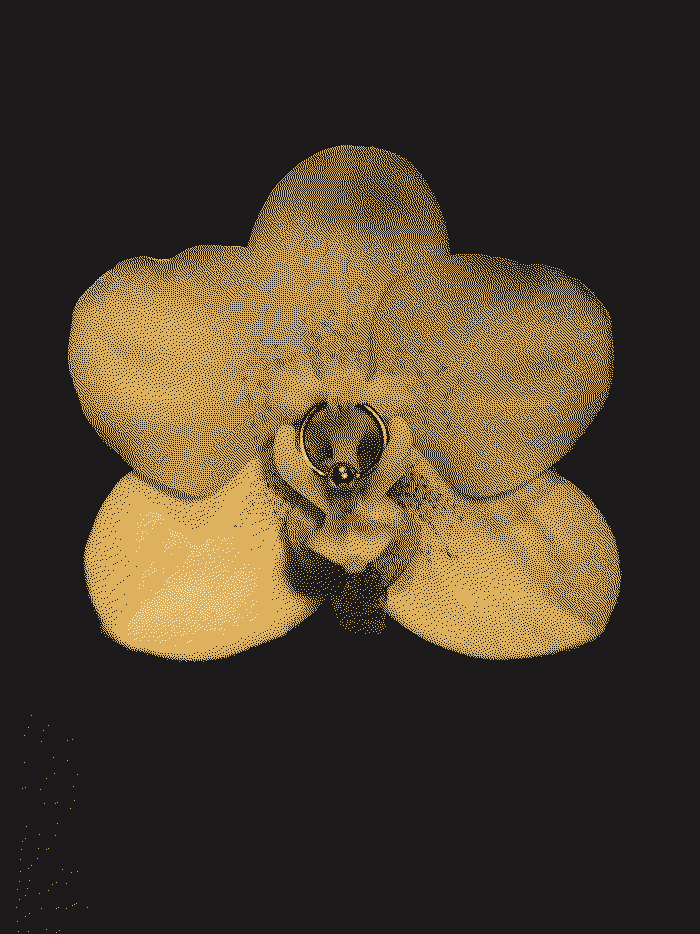

> [Everyone is beautiful and no one is horny](https://bloodknife.com/everyone-beautiful-no-one-horny/).
> 
> R.S. Benedict

**Sex and sexuality have become both increasingly free and increasingly complicated**, especially for young people and maybe even more so with the ease of access to intentional and unintentional pornography in all media.

**Outgoing connections:**
*   [[Addiction]]
*   [[Chasing happiness]]
*   [[Finite games]]
*   [[Hedonism]]
*   [[Hyperstimuli]]
*   [[Lack of love]]
*   [[Lack of masculine and feminine]]
*   [[LGBTQ+]]
*   [[Loneliness]]
*   [[Mistreatment of other humans]]
*   [[Sexism]]
*   [[Social media]]
*   [[The spectacle]]