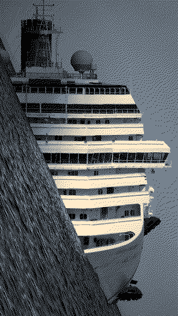

**The movement of people and their goods requires systems of transportation**. Besides walking or running, modes of transportation include bikes, horses, animal-drawn carriages, boats, cars, motorcycles, planes, other air vehicles, railway vehicles, and more. These can further be divided into what power is driving them; air, electricity, fossil fuels, muscle, etc. Wheeled vehicles need roads and highways, boats need waterways and ports, airplanes need airports, trains and trams need railways, and people need safe places to walk. Horses just need peaceful retirement. [The road to hell is paved with asphalt and the road to asphalt is paved with incentives](https://devon.postach.io/post/the-road-to-hell-is-paved-with-asphalt) that, as with much else, ignore the long-term. Asphalt degrades fast, is expensive to change, absorbs heat, contributes to air pollution, and drains badly. Our transportation infrastructure has both caused and become necessary for the global market and, even if we choose to reject globalisation, will always be a deciding factor in designing a world suitable to humans.

**Outgoing connections:**
*   [[Predicaments/Public transport]]
*   [[Traffic noise]]
*   [[Travel]]
*   [[Air travel]]
*   [[Electric vehicle solutions]]
*   [[Too much speed and noise]]
*   [[Clock time]]
*   [[Acceleration]]
*   [[Cost of living]]
*   [[Lack of dark spaces]]
*   [[Lack of quiet spaces]]
*   [[Car-centric design]]
*   [[The desacration of all places]]
*   [[Nothing is local]]
*   [[Pandemics]]
*   [[Migration]]
*   [[Inequality]]