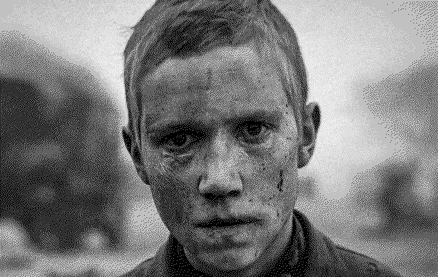

> we drifted through it, arguing.  
> every day a new war crime, every day a flower bloom.  
> we sat down together and wrote it in one room,  
> and then sat down in a different room, recording.  
> NO TITLE= what gestures make sense while tiny bodies fall? what context? what broken melody?  
> and then a tally and a date to mark a point on the line, the negative process, the growing pile.  
> the sun setting above beds of ash  
> while we sat together, arguing.  
> the old world order barely pretended to care.  
> this new century will be crueler still.  
> war is coming.  
> don’t give up.  
> pick a side.  
> hang on.  
> love.
> 
>  - Godspeed You! Black Emperor, No Title as of 13 February 2024 28,340 Dead

**A war is a violent conflict between two or more entities**. Wars can have many purposes but the most common is for the victorious to become more powerful and the defeated to either become powerless or to be vanquished completely. Most modern warfare consists of proxy-wars between the most powerful on a global stage of assumed unimportant destruction, nowadays this lethal drama is set in the Middle East. However, as time goes on and the unfulfilled promises of modernity break the surface there will be increased tensions between all entities of power.

> War is the ultimate tool of politics.
> 
> R. Buckminster Fuller

  
 Come and See (1985)

**Outgoing connections:**
*   **[[Acceleration]]** - War tends to accelerate several processes. There are perhaps two main reasons. One, close to entire populations and work forces suddenly focus on one thing only. The development and manufacturing of certain technologies benefit greatly from this monofocus. Many technological innovations have come from the need and desire to win wars. Secondly, war completely destroys any argument in favour of precautionary principles. Full steam ahead, you magnificent beast.
*   **[[Access to food]]** - Wars scorch the Earth, literally and figuratively.
*   **[[Apathy]]** - Modern warfare seems so complicated, its reasons and motives so multifaceted, that it has become difficult for people to care.
*   **[[Architecture]]** - What do you know about why the [old town of Warsaw](https://en.wikipedia.org/wiki/Old_Town,_Warsaw) is special? War shapes, changes, destroys, creates architecture.
*   **[[Artificial Intelligence]]** - War is, along with capitalism in general, the main generator of driving forces behind the race to develop and uitilise artificial intelligence.
*   **[[Attention hijacking]]** - War and porn. Bread and butter of the attention economy. The poor die unnecessarily heroic deaths in the trenches while the rich beat off.
*   **[[Biased evidence selection]]** - The winners of wars are the ones who get to select evidence that proves their own good and their enemies' evil.
*   **[[Big tech]]** - War drives big tech. [Israel's surveillance of Palestine is aided by both Google and Amazon](https://en.wikipedia.org/wiki/Project_Nimbus). Some of the world's wealthiest countries have built much of their wealth selling and exporting technologies of warfare. _[En svensk tiger](https://en.wikipedia.org/wiki/En_svensk_tiger)_.
*   **[[Blaming the people]]** - The ones who start wars are rarely or never the ones fighting them.
*   **[[Breakdown of information infrastructure]]** - Not only do the mists of war hinder the outflow of information, war also distorts all narratives relating to itself.
*   **[[Capitalism]]** - War is highly profitable and drives growth.
*   **[[Catastrophic risks]]** - A large scale world war with modern technology is a catastrophic risk.
*   **[[Centralisation]]** - Every war is a weeding out process that leaves fewer entities with increased power and agency.
*   **[[Cognitive dissonance]]** - American soldiers raped French widows in WWII. Quite dissonant heroism, don't you think? Whatever fantasy you have of the glories of war, if it doesn't include blood, death, shit, vomit, semen, rape, limbless bodies, and suicides on all sides, think again.
*   **[[Colonialist narratives]]** - The colonialist powers fighting most wars can then, through their victories, further add to their own narratives that speak of their heroic acts that keep the world in order.
*   **[[Culture wars]]** - Not all warfare is kinetic warfare. In systems of competition there can only be one culture that remains, that wins.
*   **[[Data privacy]]** - Surely, you will allow the state to look at all of your personal data if it's for the sake of your nation's safety?
*   **[[Dealing with death]]** - War is disrespectful to death. The reaper cares not for all-you-can-eat sushi.
*   **[[Debt]]** - The losers of war, if they're alive, end up indebted to the victors. However, all participants of war generate debt that can never be repaid.
*   **[[Democracy failing]]** - What say do the people have in the wars of its home country?
*   **[[Desertification]]** - Much modern warfare seems to be set on a backdrop of endless deserts. What drives what?
*   **[[Despair]]** - Endless wars. Endless despair.
*   **[[Disinformation]]** - The only way to motivate warfare is through disinformation. How else will we justify the slaughtering of people like us?
*   **[[Distractions]]** - War is distraction from life through a game with death.
*   **[[Emotional crisis]]** - Wars cause floods of emotions that no levee can withstand.
*   **[[Evil]]** - War is evil in action.
*   **[[Exponential technology]]** - Wars accelerate exponential technologies even more.
*   **[[Failure to take responsibility]]** - How are people, yes real actual people, held responsible for the decision to start wars? How can they be?
*   **[[Fear]]** - Many wars are fought through the spreading of fear through terrorism.
*   **[[Finite games]]** - Wars are the ultimate finite games.
*   **[[Genocide]]** - War is often directed at the extermination of a certain people.
*   **[[Globalisation]]** - There is a case to be made that the cold war ended through means of globalisation. Does war make the people of the world more or less connected?
*   **[[Greed]]** - The victors of war are never satiated.
*   **[[Hemispherical asymmetry (Earth)]]** - The invasion by Russia of Ukraine surprised many people. Suddenly white people were being affected by war. How terrible.
*   **[[Hobbesian views]]** - The lives of soldiers are nasty, brutish, and short. Or wait, wasn't it the lives of savages? Of humans in general? Oh, never mind. War seems to confirm our views of human nature, the same views used to justify starting wars in the first place. Civilise the savages. Savage the civilised.
*   **[[Identity]]** - A country's identity is often cemented through its warfare against a common enemy. What are you, a god damned communist?
*   **[[Ignorance of interconnectedness]]** - All evil acts reflect back, refract through, extinguishes the common flame.
*   **[[Illusion of no option]]** - Is it an illusion? Kill or be killed? There are always options...
*   **[[Immoral justifications]]** - Do the justifications for war hold up to scrutiny?
*   **[[Industrial slaughter]]** - What is war but industrial slaughter? What is industrial slaughter but a one-sided war? Imagine if Hitler bred jews for the gas chambers.
*   **[[Investing]]** - Invest in the winning side and you might become rich. Invest in technologies of war and you might rule the world no matter who wins.
*   **[[Limits to growth]]** - Global economic growth has in a sense halted global scale warfare, but how does this change when growth ends? How does war become a limit to or a controller of growth? Many unanswered (unanswerable?) questions here.
*   **[[Loss of cultural complexity]]** - Cultures perish in all wars and are silently buried with the others.
*   **[[Madness of safety]]** - The fear of war drives a madness of safety where we send AI-powered fighter jets to kill children in one place while padding our local playgrounds for the safety of our sweethearts.
*   **[[Malnutrition]]** - War zones are not conducive to healthy nutrition.
*   **[[Map and territory]]** - Wars over territory are started by people with maps and fought over parts of maps by people in the territory.
*   **[[Maximum power principle]]** - There can only be one final dominating victorious power that rules all.
*   **[[Migration]]** - The best thing to do about war is often to escape it.
*   **[[Mistreatment of other humans]]** - Torture, rape, murder, and killing is pretty clearly mistreatment. War is basically purposeful industrialised mistreatment of humans.
*   **[[Modern slavery]]** - Soldiers are slaves for higher powers. They might not feel like it. That's the point. An African-American picking cotton for his owner, chasing a future of imagined heroism and tales of glory, now that's successful conditioning. Even I sometimes feel the whip of cowardice for not having been tested in war. What idiocy.
*   **[[Moloch]]** - Moloch is the diving firehawk eclipse in zenith over every battlefield.
*   **[[Monocultures (people)]]** - Live in our new world, or die in your old one.
*   **[[Multipolar traps]]** - War is a multipolar trap. Or often the result of one, at least.
*   **[[National borders]]** - Wars draw the borders between nations.
*   **[[News]]** - Luckily for the news, there is always a war to report on somewhere. Am I the only one genuinely impressed by journalists' ability to sell newspapers that mingle celebrity gossip with war on the same front page? Rather, I'm impressed by their ability to justify their own existence when they brush their teeth in the morning.
*   **[[No precautionary principle]]** - When developing technologies with the purpose of winning wars, caution goes out the window faster than you can say Quidditch.
*   **[[Nuclear war]]** - Every war risks turning into a nuclear war. Most people would be horrified if they knew how close we've been to the apocalypse on several occasions. I would prefer if our eulogy wasn't read by [Ron Perlman](https://en.wikipedia.org/wiki/Fallout_(video_game)).
*   **[[Polarisation]]** - War polarises. Polarisation creates war.
*   **[[Poverty]]** - War is an unmatched generator of poverty on all fronts.
*   **[[Power concentration to the wrong people]]** - Humanity currently exists in systems that favour nations of war over nations of peace. Tibetans and Jains, my condolences...
*   **[[Profit]]** - It is quite easy to profit from war, don't you know?
*   **[[Propaganda]]** - Propaganda is a necessity in preparation for, during, and after war. In other words, propaganda is always necessary.
*   **[[Racism]]** - More often than not, people fighting each other belong to different "races".
*   **[[Resource conflicts]]** - Many wars are started over specific resources.
*   **[[Solutionism]]** - War is solving problems through power and death.
*   **[[Spiritual metacrisis]]** - The demons of the trenches are not the ones we should nourish.
*   **[[Story of separation]]** - War is not possible without the story of separation.
*   **[[Suicide]]** - Much of the death that spreads out from wars comes in the form of suicides.
*   **[[Synthetic biology]]** - Chemical and biological warfare is simply terrifying. And we're rushing towards it.
*   **[[The Dark Triad]]** - The triad thrives on the battlefield.
*   **[[The spectacle]]** - The killing of others has, for most of us, for now, largely become a spectacle to follow, watch, discuss, and be entertained by.
*   **[[Transportation infrastructure]]** - Many railway lines and the German highway system, to name a few, were largely built for the transportation of soldiers and weapons.
*   **[[Views on human nature]]** - Humans can be evil, nasty, terrible. Wars confirm that. They can, however, be otherwise.
*   **[[Violence]]** - Kinetic warfare is a game whose main play is the use of violence.