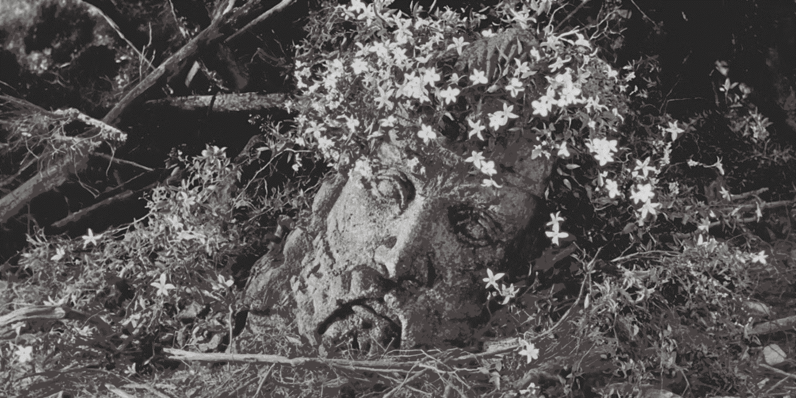
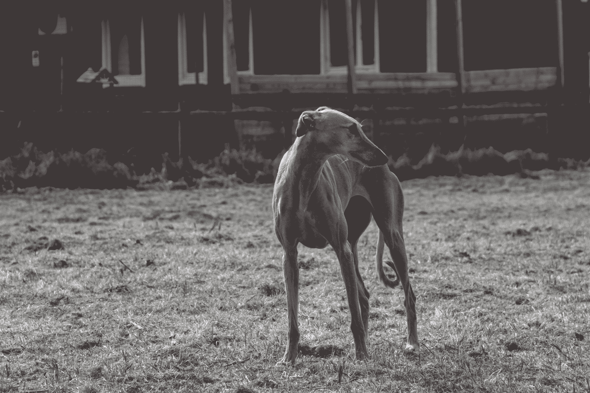

## An Ecophilosopoetic Attempt at Sense-Making

> The landscape's purpose
> lies under its surface
> 
> To see both forest, trees,
> and mycelia beneath

**What is the point of this?**  
All around, people are looking to act and _do something_. Often their eagerness to act, perhaps understandably so, outpaces their wisdom in choice of action. Don't get me wrong, we are in a hurry, in fact, we're too late, way too late. But one of the reasons for being late is that most attempted solutions have pushed us further down the same tracks we're eager to leave behind. The problem is that there isn't any singular problem. There are many, infinitely many, and we won't _solve_ them. If we don't know where we are or where we are going it does not matter how fast we're moving. This landscape was mapped with a certain question in mind, namely, what is the problem? What are the problems of modernity? Are they even problems to begin with?

**Predicaments**  
Problems require solutions, predicaments require continuous management. Predicaments in the landscape are categories or formalisations of certain unfortunate or trying conditions. The landscape further hints at the main predicament of modernity, namely the complex and extensive network of connections between all predicaments. These connections are the reason why we seem unable to untangle ourselves from what appear to be solvable, if not already solved, problems. The network of tangled connections is _the_ predicament of modernity. If we do not manage the predicaments of the landscape wisely we will lose everything. This is the challenge of our time and we must attempt to make sense of it to the best of our ability. By mapping the landscape and its features, describing what they are and how they're connected, my belief is that we might be able to go from an oversimplified narrative to a slightly more complex and interconnected understanding of our predicament. I am in no way the first to attempt this but I believe that each additional viewing angle can contribute in creating a parallax effect for the predicament of our time.

**All of this is wrong**  
The predicament landscape is affected by many of the predicaments it contains. It is therefore of importance to understand a few things before you dive in. These predicaments illustrate the difficulties of modernity in the same way an anatomical chart illustrates a human body. To understand the whole, we tend to need to break things down into categories, smaller parts that share certain characteristics. However, an anatomical chart gives no real understanding of life. Don't get caught up on any single predicament that happens to grab you. Rather, allow yourself to be swept away by what lies underneath all predicaments, the wholeness the landscape points towards. This is not an attempt to categorise _the_ definitive predicaments, it is simply an illustration of one approach to making sense of our situation.

> The real voyage of discovery consists not in seeking new landscapes, but in having new eyes.
>  
> Marcel Proust

**Ecology, Philosophy, and Poetry**  
No single branch of science or the arts is enough to make sense of the complexity of our predicament. Instead, this project will move in-between and on the edges of whatever disciplines are necessary. There are however three that stick out, namely: ecology, philosophy, and poetry. Ecology is the study of our dwelling place. Philosophy is a love of wisdom as well as a comprehensive system of belief and principles. Poetry is... a difficult one to define. Which is its strength. Poetry is the process of emergence of something that did not previously exist. Poetry is making. Poetry tries to capture the unspeakable in words. Putting all of these together as ecophilosopoetic:

_A philosophy for the making of our dwelling place_

**The future**  
Discovering this landscape might lead to a sense of impending doom, hopelessness, and despair. Maybe rightly so. William Gibson said "the future has arrived, it's just not evenly distributed". There are ways of managing these predicaments and their connections and many are already being employed. The positive thing with complexity in this case is that just as we can't know what creates negative cascade effects we also can't be sure what creates positive ones. Complexity allows for emergence and unexpected behaviour. In other words, if there is room for complete despair there is also room for hope. My intention is two-fold. First, it is vital to recognise just how difficult of a situation we are in and, second, it is crucial to recognise that there are things we can and must do to manage the situation. What area of the landscape do you have an interest in? What predicament could you help manage? Which predicaments are related to what you're working to change? How might changing certain predicaments affect the management of the predicament you're focused on? Are there people prioritising predicaments you don't care about? Why do you think they prioritise in that way and what might be the reason for your indifference?

A problem well-stated is half-solved. This landscape does not give solutions or answers. My hope is that it leads those exploring it to find agency in discovering the right questions. I am tempted to say I want to provide a path through the landscape that leads to a better future but, for one, there isn't truly any real predicament landscape to walk through and, secondly, in the words of Krishnamurti, "truth is a pathless land".

A difficult realisation to come to terms with is this: If we make it, whatever _we_ means and whatever _making it_ means, we who are alive when this is being written will not live to see that different world because people very different from us will have to inhabit it. The change needed is on a timescale beyond a human life. What we will do however, what we must do, is find the flower-filled cracks of modern life and find our strength there, make our dwelling there and do the work needed by us to spread outward. There lies life. In that way, maybe, the king could again have a crown.

  

**How to read this**  
Reading this may require certain skills and abilities we've largely let atrophy. If I was to pick one thing needed to read this properly it would be _acceptance of confusion_. Let yourself be confused for longer than you're inclined to. Let me illustrate what I mean with a quick example. If you're reading a book where words unknown to you keep popping up you might stop at each word, look it up in a dictionary, and continue reading. That approach will not work particularly well in this case. The alternative is to simply keep reading and instead of letting the text linearly create a path you must allow the drawing out of a patchy line and trust that the process will eventually lead to the line being filled out. Float through sections you don't understand, trudge through sections that confuse you, push through or temporarily skip sections that generate resistance and frustration. If you've ever thought that koans are bullshit I implore you to explore it further and reconsider. If and when this writing creates confusion, contradiction, or incites strong emotion, I believe that is when things get interesting and fertile for change.

**Links - Outgoing & Incoming**  
Do not confuse the direction of links between predicaments for causality or anything resembling direct linear effects. Outgoing links are what a predicament might flow towards, drive, feed into, lead to, or create. If a predicament is a body of water, the outgoing links are rivers, creeks, and rapids flowing away from that body of water. Incoming links are the inflows to that body of water. Incoming links might drive the selected predicament, outgoing links might be driven by the selected predicament. Sort of. Maybe.

**The Predicaments**
1. [[Acceleration]]
2. [[Access to food]]
3. [[Access to water]]
4. [[Addiction]]
5. [[Advertising]]
6. [[Agriculture]]
7. [[Air travel]]
8. [[Algorithmic curation]]
9. [[Ancient sunlight, old sunlight, current sunlight]]
10. [[Animal views]]
11. [[Apathy]]
12. [[Architecture]]
13. [[Predicaments/Art]]
14. [[Artificial Intelligence]]
15. [[Attention hijacking]]
16. [[Avoiding radical options]]
17. [[Avoiding uncertainty]]
18. [[Being reasonable]]
19. [[Biased evidence selection]]
20. [[Big tech]]
21. [[Biodiversity loss]]
22. [[Blaming the people]]
23. [[Breakdown of information infrastructure]]
24. [[Bullshit jobs]]
25. [[Bureaucracy]]
26. [[Business-as-usual narrative]]
27. [[Capitalism]]
28. [[Carbon fundamentalism]]
29. [[Car-centric design]]
30. [[Carelessness]]
31. [[Cars]]
32. [[Catastrophic risks]]
33. [[Centralisation]]
34. [[Chasing happiness]]
35. [[Climate change]]
36. [[Climate footprints]]
37. [[Clock time]]
38. [[Cognitive dissonance]]
39. [[Colonialist narratives]]
40. [[Complexity mismatch]]
41. [[Constant connectivity]]
42. [[Consumerism]]
43. [[Cost of living]]
44. [[Predicaments/Craft]]
45. [[Culture wars]]
46. [[Data privacy]]
47. [[Dealing with death]]
48. [[Debt]]
49. [[Deforestation]]
50. [[Delusional domination of nature]]
51. [[Democracy failing]]
52. [[Desertification]]
53. [[Despair]]
54. [[Directionlessness]]
55. [[Discrimination]]
56. [[Disinformation]]
57. [[Dispositionism]]
58. [[Distractions]]
59. [[Dogmatism]]
60. [[Ecological crisis]]
61. [[Educational crisis]]
62. [[Educational systems]]
63. [[Ego]]
64. [[Elderly care]]
65. [[Electric vehicle solutions]]
66. [[Emotional crisis]]
67. [[End of history]]
68. [[Energy consumption increasing]]
69. [[Energy]]
70. [[Evil]]
71. [[Exponential technology]]
72. [[Extreme weather]]
73. [[Failure to take responsibility]]
74. [[Faulty meta-optimisation]]
75. [[Fear]]
76. [[Finite games]]
77. [[Genetic modification]]
78. [[Genocide]]
79. [[Globalisation]]
80. [[Global supply chains]]
81. [[Government]]
82. [[Greed]]
83. [[Greenwashing]]
84. [[Growth]]
85. [[Healthcare]]
86. [[Hedonism]]
87. [[Hemispherical asymmetry (Brain)]]
88. [[Hemispherical asymmetry (Earth)]]
89. [[Hobbesian views]]
90. [[Hyperstimuli]]
91. [[Identity]]
92. [[Ignorance of everything being sacred]]
93. [[Ignorance of interconnectedness]]
94. [[Ignorance of ongoing collapse]]
95. [[Ignorance of the mystical]]
96. [[Ignorance of the mythical]]
97. [[Ignored externalities]]
98. [[Ignoring complexity]]
99. [[Ignoring diversity]]
100. [[Illusion of competence]]
101. [[Illusion of GDP decoupling]]
102. [[Illusion of no option]]
103. [[Illusion of understanding]]
104. [[Immoral justifications]]
105. [[Imprisonment]]
106. [[Individualism]]
107. [[Industrial slaughter]]
108. [[Ineffective institutions]]
109. [[Inequality]]
110. [[Inertia]]
111. [[Information isn't knowledge]]
112. [[Insect loss]]
113. [[Investing]]
114. [[Jevons paradox]]
115. [[Knowledge isn't wisdom]]
116. [[Lack of agency]]
117. [[Lack of a living world view]]
118. [[Lack of attentiveness]]
119. [[Lack of balance]]
120. [[Lack of belonging]]
121. [[Lack of communities]]
122. [[Lack of compassion]]
123. [[Lack of cultural control systems]]
124. [[Lack of dark spaces]]
125. [[Lack of empathy]]
126. [[Lack of faith in anything]]
127. [[Lack of feeling needed]]
128. [[Lack of historical insight]]
129. [[Lack of humility]]
130. [[Lack of love]]
131. [[Lack of masculine and feminine]]
132. [[Lack of purpose]]
133. [[Lack of quiet spaces]]
134. [[Lack of resilient systems]]
135. [[Lack of systems thinking]]
136. [[Lack of the longterm]]
137. [[Lack of time]]
138. [[Lack of visions]]
139. [[Predicaments/Language]]
140. [[Laws]]
141. [[LGBTQ+]]
142. [[Limits to growth]]
143. [[Lobbyism]]
144. [[Loneliness]]
145. [[Loss of cultural complexity]]
146. [[Madness of safety]]
147. [[Malnutrition]]
148. [[Map and territory]]
149. [[Mass climate migration]]
150. [[Material extraction]]
151. [[Maximum power principle]]
152. [[Meaning crisis]]
153. [[Meat eating]]
154. [[Mental health]]
155. [[Microplastics]]
156. [[Migration]]
157. [[Mind-body separation]]
158. [[Misinformation]]
159. [[Missing elders]]
160. [[Mistreatment of animals]]
161. [[Mistreatment of other humans]]
162. [[Modern slavery]]
163. [[Moloch]]
164. [[Monocultures (agriculture)]]
165. [[Monocultures (people)]]
166. [[Monopolies]]
167. [[Multipolar traps]]
168. [[Naive progress narrative]]
169. [[Naive techno-optimism]]
170. [[Naive techno-pessimism]]
171. [[National borders]]
172. [[Net negative caloric extraction]]
173. [[News]]
174. [[Nihilism]]
175. [[No precautionary principle]]
176. [[No respect for indigenous wisdom]]
177. [[Nothing is local]]
178. [[No value in maintenance]]
179. [[Nuclear war]]
180. [[Obesity]]
181. [[Ocean acidification]]
182. [[Only 'can we' never 'should we']]
183. [[Oppressive tyrannies for the good of its victims]]
184. [[Out of touch with seasons]]
185. [[Over-reliance on technology]]
186. [[Pandemics]]
187. [[Predicaments/Parenting]]
188. [[Planetary boundaries]]
189. [[Poisoning the water, the earth, the air]]
190. [[Polarisation]]
191. [[Pollution]]
192. [[Population growth]]
193. [[Populations entering the 'middle class']]
194. [[Poverty]]
195. [[Power concentration to the wrong people]]
196. [[Profit]]
197. [[Propaganda]]
198. [[Predicaments/Public transport]]
199. [[Quality]]
200. [[Quantification]]
201. [[Racism]]
202. [[Rationalism]]
203. [[Reductionism]]
204. [[Resource conflicts]]
205. [[Resources]]
206. [[Sameness]]
207. [[Scientism]]
208. [[Sedentary lifestyles]]
209. [[Selfishness]]
210. [[Sense-making crisis]]
211. [[Sex and sexuality]]
212. [[Sexism]]
213. [[Signal-to-noise ratio]]
214. [[Simplifications]]
215. [[Slow change]]
216. [[Social erosion]]
217. [[Social media]]
218. [[Soil erosion]]
219. [[Solutionism]]
220. [[Spiritual metacrisis]]
221. [[Status]]
222. [[Story of separation]]
223. [[Suicide]]
224. [[Surveillance]]
225. [[Sustainable growth]]
226. [[Synthetic biology]]
227. [[The Dark Triad]]
228. [[The death of creative work]]
229. [[The desacration of all places]]
230. [[The impossibility of UBI]]
231. [[The minimisation of all things wild]]
232. [[The spectacle]]
233. [[Tipping points]]
234. [[Too much speed and noise]]
235. [[Traffic noise]]
236. [[Tragedy of the vanishing commons]]
237. [[Transportation infrastructure]]
238. [[Travel]]
239. [[Unbalanced longtermism]]
240. [[Unemployment]]
241. [[Unheeded warnings]]
242. [[Unpaid important labour]]
243. [[Views on human nature]]
244. [[Violence]]
245. [[Virtue signalling]]
246. [[War]]
247. [[Waste]]
248. [[Weber's iron cage]]
249. [[Wisdom crisis]]
250. [[Yuppie dystopia]]

**Note: In progress**  
As you can probably see, much of the landscape is unfinished. I have chosen to work publicly on this project and there is much left to do. Some of the future plans:

- Go through all connections and add more
- Motivate each connection/link between predicaments
- Illustrate each predicament
- Illustrate the landscape/map
- Add sources and fix a footnote system
- Add links, further reading, emphases, and more
- Start writing part II, the overlay of existing and future methods of managing the predicaments - [[The Overlay]]. If you have suggestions for this, please get in touch!

**Note: Poetry and pretentiousness**  
It is absolutely okay to not understand what the fuck I'm talking about in some of the predicaments. It is also fine if you roll your eyes at the postmodernistic pseudopoetic pretentious mess that I sometimes dive into. Try reading it backwards or upside down and it might make more sense. Maybe put on some [calming jazz](https://www.youtube.com/watch?v=rOFBkc2pWWQ) and read it out loud. Or maybe just brew yourself a cup of single origin anaerobic Ethiopian heirloom variety espresso on your 1981 La Pavoni Europiccola while contemplating how much Proust loves hawthorn bushes. Beats me. Love you.

**Note: Disagreement**  
Do you disagree with something? Do you think something is blatantly wrong or deluded? Do you think something here might create more problems? Do you have something you think should be added? Do you think I'm an idiot? Do you disagree so vehemently that you feel a wrath that could split the Earth? Cool. Don't hesitate to write me an email. I'm grateful for any feedback or input that you might have. I'm not an expert, I'm just an innocent explorer trying to slowly wander upon truths. In this exploration I will, as you will, be both lead and corrupted by my conditioning, personality, opinions, and excentricities. Maybe we can help each other see the in-between?

[david@punk.ist](mailto:david@punk.ist)

**Note: Who am I to believe I have something to say?**  
I am no one and, in John Cage's words, I have nothing to say and I am saying it and that is poetry as I need it. I'm just trying to channel and synthesise what others are saying and maybe spice it up a bit. Don't worry about who I am, it matters not. But again, it also does. I'm just a normal guy. Read into that what you must.

**Note: Opinions**  
Maybe everything I've ever written is just a hyperrationalisation of why I like what I like. Yeah, I really love riding bikes, I always have. I like old buildings and jazz more than new buildings and pop. I happen to really fucking loathe the workings of modernity and the bullshit-spewing morons it makes of us. Just my opinions though. I guess I'm just lucky in that all my opinions happen to also be correct. Strange how that happens.

**Note: Missing Predicaments**  
These predicaments are arbitrary points in a continuous landscape of predicaments. In other words, I could've picked 250 completely different predicaments. However, I believe this isn't that important.

Let's take, as an example, some predicaments I _haven't_ included. **Gut bacteria** and **Screen time for children**. There is a case to be made, quite a convincing one, that almost everything about modernity could stem from a reduced diversity of gut microbiota in the global population. It might almost sound ridiculous but research keeps heightening the seeming importance of the gut microbiota in everything from mental health issues to overall mood and thinking. When I claim that most issues of modernity start as thoughts and these thoughts are influenced by our gut microbiota then shouldn't that be a central predicament? Well, perhaps. Instead of focusing on every single predicament we should envision the gestalt they're a part of. Some predicaments that could be related to gut microbiota are Access to food, Complexity mismatch, Malnutrition, Monocultures (Agriculture), and Pandemics. What food do we have access to? Is our microbiota as complex as it used to be or needs to be? Have we reduced the diversity of the microbiota through malnutrition and agricultural practices? Has our war on bacteria related to the fear of pandemics played a part in this? All of these connections between the included predicaments circle an area of the landscape that could contain several other predicaments. Find those connections yourself, grasp the entire landscape's gestalt, and you're getting it. The same goes with the example of screen time for children. Put an iPad in front of a three year old and I wouldn't be surprised if you irreversibly screw them up. What might that be connected to in the landscape?

**Note: For Hilma**  
If you have found value in this project and you have a steady income I would be grateful for any donations you could give. If you need further incentive most of the donations will go to feeding my dog Hilma. As you can see, she is very skinny and needs all the food she can get.

  
[Buy Hilma some food](https://ko-fi.com/punkistpoet)

**Note: Why 250?**  
Why 250 predicaments? Why not one single predicament which, if we manage it, makes everything right? Why not 10 or 100 or 1000? Mostly, it's arbitrary. But not entirely. Every system can be divided into an infinite amount of subsystems, complexity arises on all scales and will always have to be abstracted in order to make sense of anything. One must choose where to draw boundaries. The main inspiration for the structure of this work is the architectural tome A Pattern Language by Christopher Alexander et al. Their book is divided into 253 different architectural patterns on different scales and these patterns are, like the predicaments, connected in different ways. A Pattern Language includes this in its introduction: "_At the core is the idea people should design their homes, streets, and communities. This idea comes from the observation that most of the wonderful places of the world were not made by architects, but by the people_". Most of the wonderful care for the world comes not from politicians, economists, investors, technologists, or rulers, but by the people. That source of inspiration is one reason for the 250 predicament boundary.

The other reason is that I've found 250 to be a good number for me to understand the whole of something without getting lost in the parts, still seeing the forest while french-kissing a single beech leaf. I have also found it to be a number of predicaments large enough to feel challenging but low enough to feel possible. But, in short, the boundary is mostly arbitrary.

**Note: Structure**  
Every predicament in the landscape contains three parts. The first part acts as a summary, definition, or similar of the predicament in question. The second part details the predicament's connection to other predicaments in the landscape and how these connections might behave. The third part attempts to find some way of management, be that through identifying leverage points, cascade effects, existing solutions, or progressive initiatives. This third part will most likely be an overlay on the landscape that sees the possibilities of a better future through existing or future initiatives.

**Note: What about the solutions?**  
Well, first of all, there are none. There are potential management methods, initiatives, changes, directions, all of which will affect the landscape. Currently, this landscape focuses on the question that triggered its creation, namely "what's the problem?", but there is an ongoing thought process in the back of my head collecting what I think the landscape needs of us. My first project [punk.ist](www.punk.ist) was, in hindsight, an attempt to find pockets of sane actions in the insanity of the world. Presently, there is simply a list of ideas I call the [[The Overlay]].

**Note: Before you dive in...**  
Quick therapy session. Lay back, chill out, breathe. To truly internalise the complexity of the mess we're in you might go through some difficult emotions. In fact, there is something missing if you don't. Before you dive in it is useful if you have a place of support and comfort to return to. This could be mindfulness of breathing, music, taking a walk, being with a loved one, or similar. Just make sure you don't push yourself into too much suffering in order to "understand" or "get" the gist of the landscape. Surf smoothly, don't crash and splash. Good luck. Oh, and if you lack support you can simply send me an email and we'll see what we can do.

**Note: Footbinding**  
Are your feet bound? There is an old Chinese tradition known as [foot binding](https://en.wikipedia.org/wiki/Foot_binding), the aim of which is for women to have so called lotus feet, a status symbol and mark of beauty. Can you remember when your feet were bound? There was a time during my childhood where a tear developed in the binding. The years passed but the fabric continued to tear, slowly, despite my efforts to patch it up. A new tear appeared during my university studies, the flesh of my foot nearly bulged out of it, the fresh air burning its skin. Years later, the binding broke. None of my shoes would fit my wide and ugly feet. I started regaining muscle and control of my toes. I could walk, I could run, though it appeared strange to others. They're now calloused and strong, they keep me grounded and stable on the ground. There's just one issue. For certain parts of my existence and the wellbeing of those I am responsible for I have to wear modernity's shoes, yet none fit, they're cramped and angled, people I talk to might humour me but they know I'll always be barefoot. Take off your shoes and join me? It will be too difficult to find your way in the landscape with feet bound. In the words of [Qiu Jin](https://en.wikipedia.org/wiki/Qiu_JinQiu), _unbinding my feet I clean out a thousand years of poison_.

**Note: Doubts about darkness**  
Should I avoid writing from sources that contain lifetimes of darkness, anger, hatred, and despair? There is a vital point in honesty and multifaceted emotions... But can the words be charged with the same hatred they're aiming to extinguish without spreading more hatred instead?

**Note: I am not wise**  
You might be wondering what right I have to write all of this. Do I really know enough? Am I clever? Am I wise? We all have varying degrees of wisdom and I often find that there are several voices within that come out in the writing of this work, some less wise than others. Others slightly more wise. I believe there is value in this simply because this type of thinking is so unexplored today that whatever tiny bit of wisdom and intellect one can pour into it, it will change it. I am young. I've always been slow to learn, slow to understand, bad at most things. I am not wise, at least not yet. I've had a privileged upbringing, but still, I have missed many, maybe even most, of my past years in mists of depression. I often speak more than I listen, act less than I think, and feel less than I think. There are conditioned beliefs that are near impossible to discern from truth, there is anger, aggression, hatred, crashing waves in places of required stillness, dried up rivers that should smooth out the crust of the Earth. Do not get hung up on who has written all of this, just try to find what resonates or changes you. Wisdom is not a state of being, it is a flow of becoming. It also matters little whether or not I am wise or you are wise. What matters is the collective wisdom.

**Note: Doubts about explicitness**
Should things be stated explicitly? Is it harmless to be concrete? Is there any good in specificity and concreteness? The more I write, the more I speak, the more I feel the urge to return to silence. Can I externalise the internal ongoings that this so-called "landscape" is hinting at? The more vague I express myself, the more true it feels to me. Yet, where does my will to change the course of the world fall in that case? Do you float downstream helplessly and paralysed or do you struggle towards shore to join those with shovels trying to create a new stream? How would the landscape appear coming from my guitar?