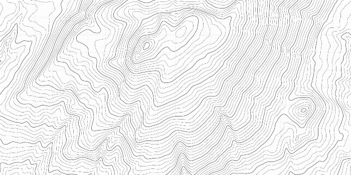

# Update & Future Work
The work with this landscape is at a standstill. Certain conditions have lead to me having to focus on applying for jobs and this process seems to zap all energy from me. However, the work proceeds mentally and some aspects of this landscape are becoming clear.
## The Links
The work that is most pressing is the outgoing links of the predicaments and their motivations. I believe these links are the key for a gestalt of our human predicament to start appearing. Nothing is ever a singular problem in isolation and no solution can be treated as a closed loop. As of writing this there are still 224 predicaments left that require re-linking as well as motivations written for those links. This can be facilitated by a continued work of...
## Metacrisis Categorisation
Some predicaments fit neatly together like houses in a village, mountains on an island, or nations of a continent. There is an ongoing but non-published process of sorting and categorising predicaments. This serves two functions. Firstly, it's mentally much easier to work in chunks. Secondly, it is crucial for the map-making. See, the map-making, I have changed my approach...
## Mapping the Landscape
There are two ideas currently floating around and I sense it might be necessary or at least valuable to pursue both. The first is to scrap the tiny part that has been mapped (with a bit too much detail) so far and instead simplify it to something whose landscape is clearly visible but where each predicament appears as a point of interest, similarly to something like this, drawn from the map for The Elder Scrolls V: Skyrim:

But there is, as mentioned, a second idea, an idea which includes the amount of links each predicament has. This idea is less clear in my mind but could it be reasonable to make a topographic map where every predicament category is a mountain range and each mountain a predicament? The height of the mountain could then be directly related to how many links the predicament has. Perhaps?

In summary, I will revise how the actual map is to be made and then most likely illustrate and then publish all of it at once instead of in tedious, badly hand-drawn chunks.

There is also a growing desire to turn away from the predicaments, the burning building of modernity, and turn towards life, towards what to do, what to envision. Currently, I just call this...
## The Overlay
250 counter-elements to each predicament, hopefully with even more cosmic implications. I have started to write some of these already and will start publishing material soon. It is still mostly in research mode, where I collect resources, quotes, thoughts, ideas, and practices. The overlay excites me but it also scares me. Why? I'm not sure. There is, perhaps, a certain distance between one's self and one's complaints, as if expressing what one dislikes is just a stone cast into space. What one truly believes is good, beautiful, true, or right points straight to one's soul, it is a deeply personal exposure and each stone cast forms a structure reflecting one's deepest desires and dreams. It's easy to believe that everyone is too dumb for their own good. It's not that easy to wish that everyone could become wiser. Is it because it risks disappointment? Or it forces one to be clear about one's priorities? With luck and perseverance, some of these questions might approach answers as I dive into the work with the overlay.

What then? 250 predicaments and 250 overlaid possibilities. What has been achieved? I'm not sure.
## The Future
The more I work with creating this landscape, the more aware I become of its purpose. You mustn't worry that I am somehow blissfully unaware of the fact that few, if any, will read all of it, or even any of it. The purpose of this landscape, at its core, is, I believe, a public research project that will lead to something else, something more accessible and, dare I say, straight-forward. The Predicament Landscape is a 5CD collection of free improvisation jam sessions that will, or might, be condensed into an album short enough to fit on an LP. If you know how Talk Talk recorded their last two albums you might have good idea of what I mean. If you don't, [shame on you](https://en.wikipedia.org/wiki/Spirit_of_Eden#Recording). There is much uncertainty about how this will happen or what it will concretely be but since I am the way I am, I often prefer the improvisational jamming to the album. But that's me. I want to be of service to others and for all of this to have some sort of empowering effect on people, on you reading this.

> A writer is a person who cares what words mean, what they say, how they say it. Writers know words are their way towards truth and freedom, and so they use them with care, with thought, with fear, with delight. By using words well they strengthen their souls. Story-tellers and poets spend their lives learning that skill and art of using words well. And their words make the souls of their readers stronger, brighter, deeper.
> 
> Ursula K. Le Guin

I don't see myself as a writer, in fact I don't see myself as anything, but I will continue to write and continue to do so with ferocity. Somehow, I will have to make it work while simultaneously prioritising providing for those I love. Challenging. But what is life if it lacks challenges?

\---

If you want to have a chat about anything related to this, [send me an email!](mailto:david@punk.ist)

> Teach the children. We don't matter so much, but the children do. Show them daisies and the pale hepatica. Teach them the taste of sassafras and wintergreen. The lives of the blue sailors, mallow, sunbursts, the moccasin flowers. And the frisky ones – inkberry, lamb's-quarters, blueberries. And the aromatic ones – rosemary, oregano. Give them peppermint to put in their pockets as they go to school. Give them the fields and the woods and the possibility of the world salvaged from the lords of profit. Stand them in the stream, head them upstream, rejoice as they learn to love this space they live in, its sticks and leaves and then the silent, beautiful blossoms. Attention is the beginning of devotion.
> 
> Mary Oliver

Blessings to you all

/David